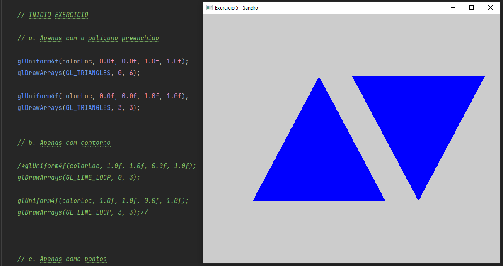
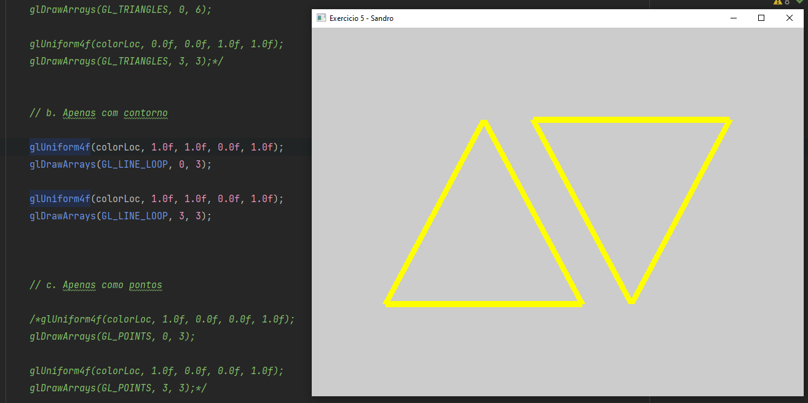
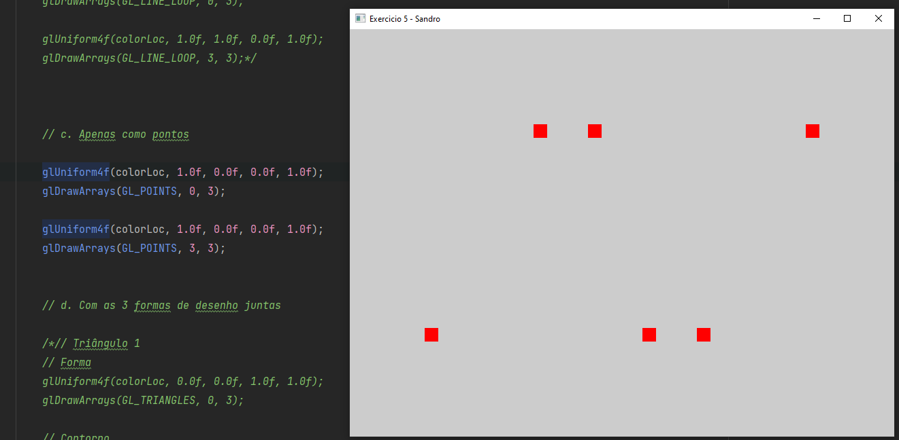
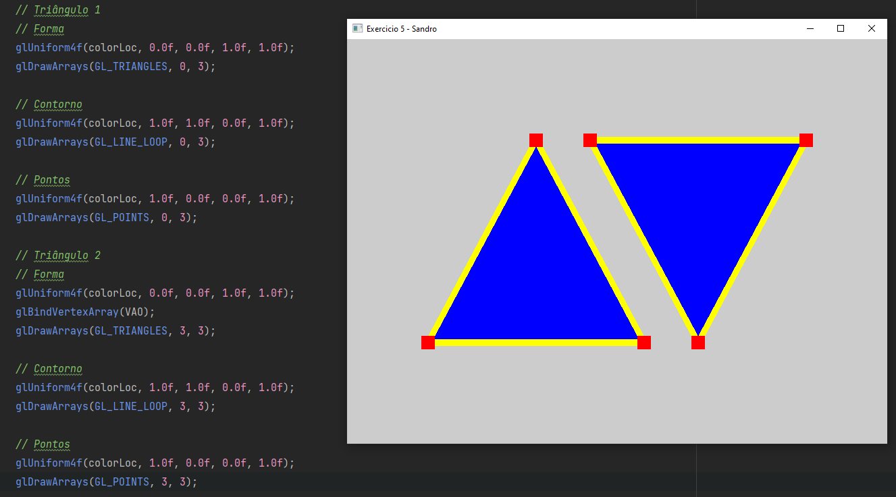
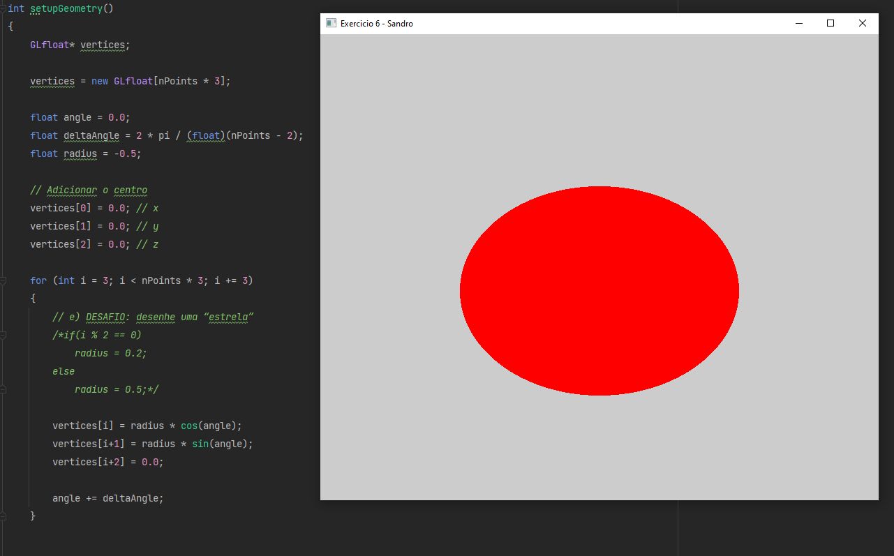
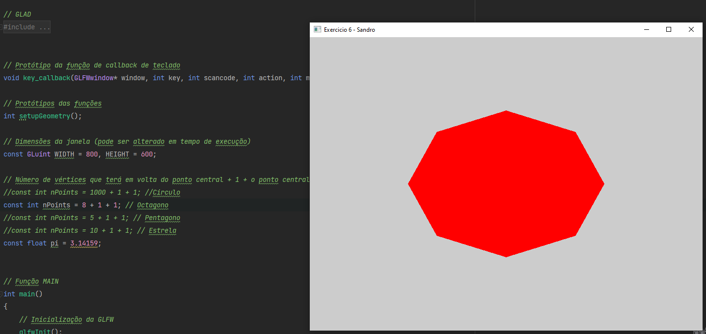
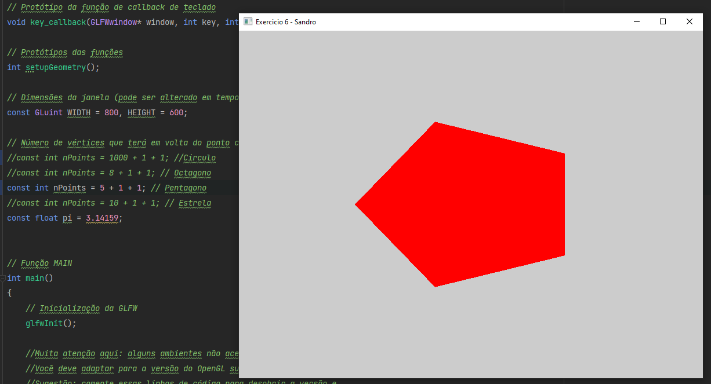
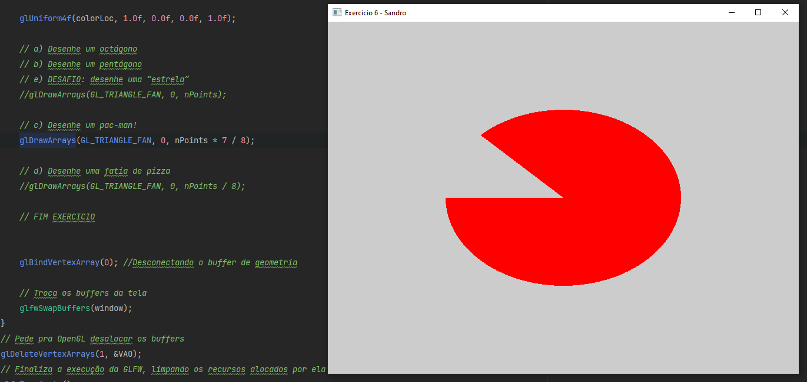
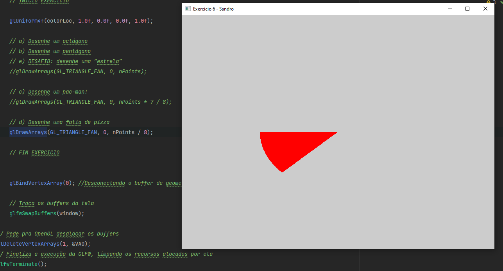
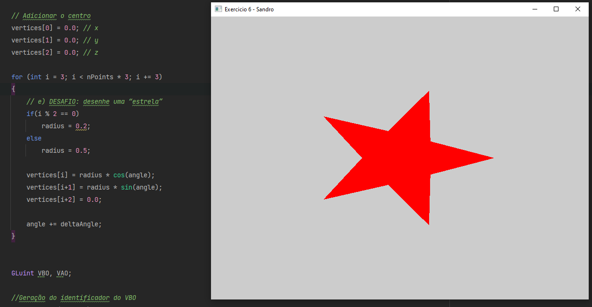

# PG2023-1

###### Introdução à OpenGL Moderna – Shaders & Buffer Lista1

<b> 5. Faça o desenho de 2 triângulos na tela. Desenhe eles: </b>

a. Apenas com o polígono preenchido

b. Apenas com contorno

c. Apenas como pontos

d. Com as 3 formas de desenho juntas

<b> 6. Faça o desenho de um círculo na tela, utilizando a equação paramétrica do círculo para gerar os vértices. Depois disso: </b>

a) Desenhe um octágono

b) Desenhe um pentágono

c) Desenhe um pac-man!

d) Desenhe uma fatia de pizza

e) DESAFIO: desenhe uma “estrela”

