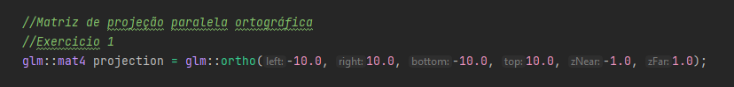
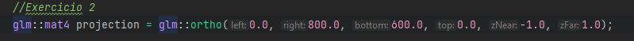
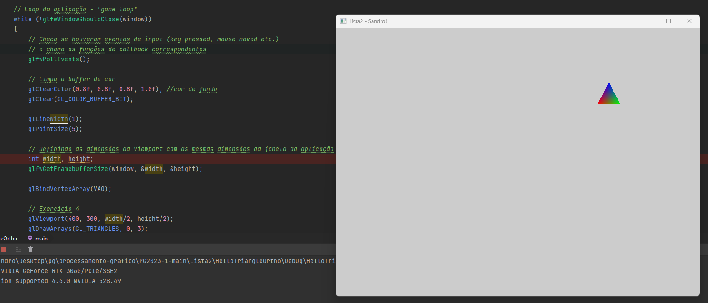
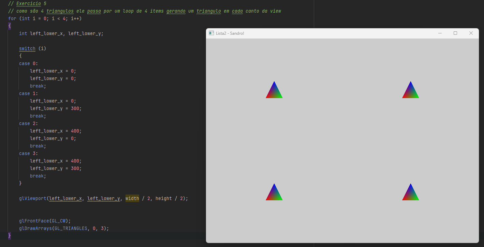

# Introdução à OpenGL Moderna – Sistemas de Coordenadas e Câmera 2D

<b> 1. Modifique a janela do mundo (window/ortho) para os limites: xmin=-10, xmax=10, ymin=-10, ymax=10.</b> 

 

<b> 2. Agora modifique para: xmin=0, xmax=800, ymin=600, ymax=0.</b> 

 

<b> 3. Utilizando a câmera 2D do exercício anterior, desenhe algo na tela. O que acontece
quando posicionamos os objetos? Por que é útil essa configuração?</b> 

Definir as extremidades mínimas e máximas dos eixos x e y é uma configuração útil para determinar o ponto inicial e final da 
contagem, especialmente quando se utiliza o padrão comum de iniciar a partir do canto superior esquerdo. Após configurar corretamente, 
é possível desenhar na tela com precisão, seguindo as instruções fornecidas nos exercícios subsequentes.  

<b> 4. Modifique o viewport para desenhar a cena apenas no seguinte quadrante da janela
da aplicação:</b> 

 

<b> 5. Agora, desenhe a mesma cena nos 4 quadrantes.</b> 

 
