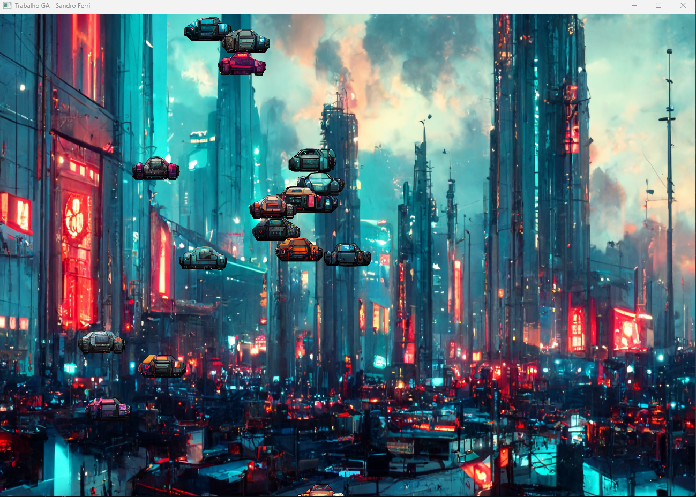

# Trabalho do Grau A

Projeto de um game, destinado para realização do trabalho da disciplina de Processamento Gráfico.

O projeto é um joguinho de fuga de carros, onde o objetivo é não deixar os outros carros baterem no teu.

### Recursos utilizados

- C++
- Modern OpenGL
- Ide Rider

### Start Game

Para iniciar o jogo pressione uma tecla de movimento (W, S, A, D)

### Simulação do Jogo

### Game Over

Para jogar novamente pressione uma tecla de movimento (W, S, A, D)

------------------------------------------------------------------------------------------------------------------

### Como configurar o ambiente:

- Faça clone do projeto;
- Importe o projeto para a IDE de sua preferencia;
- Defina a versão da PlatformToolset de acordo com a versão do seu computador (o projeto está configurado para rodar na 143)

